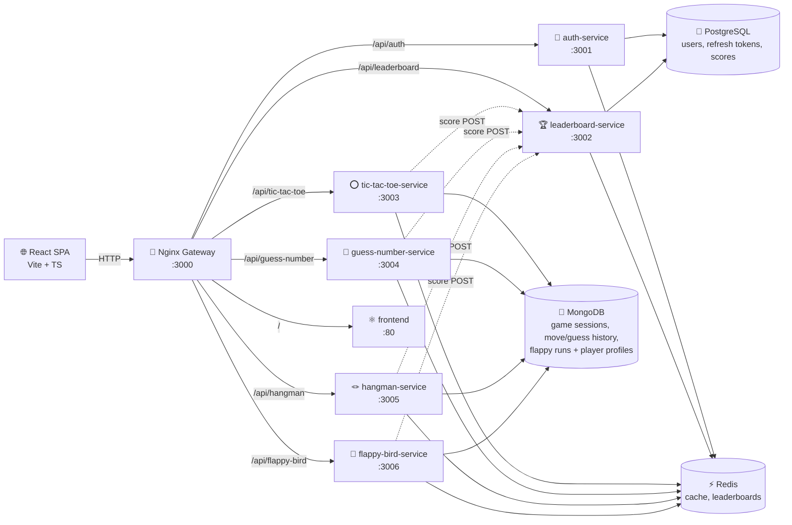
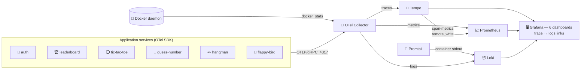
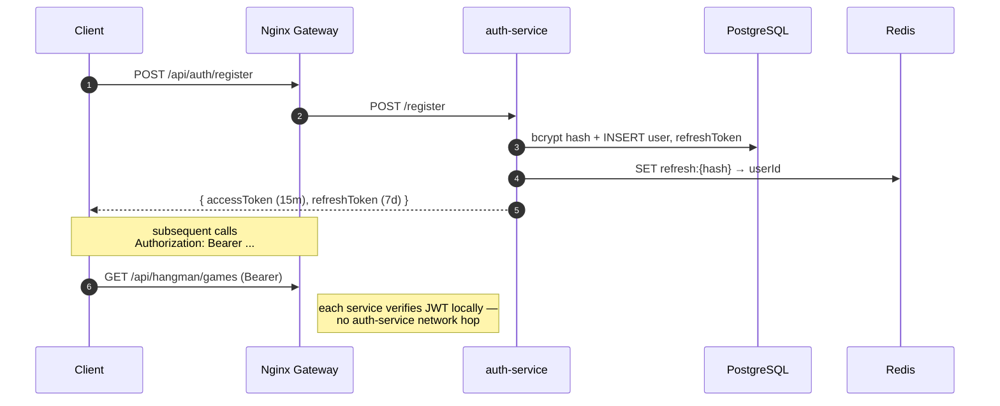
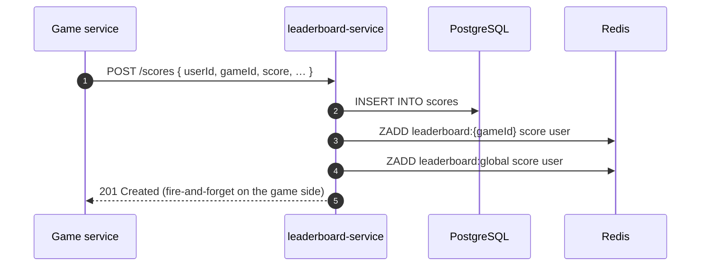
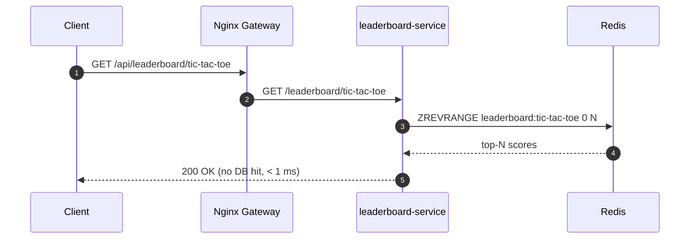
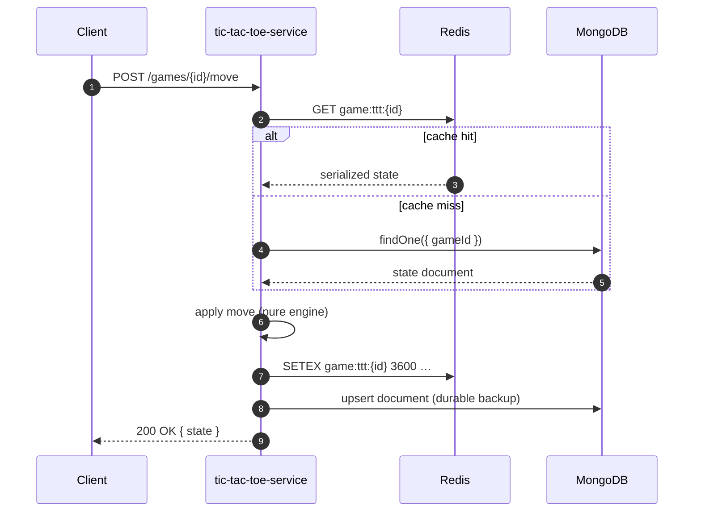
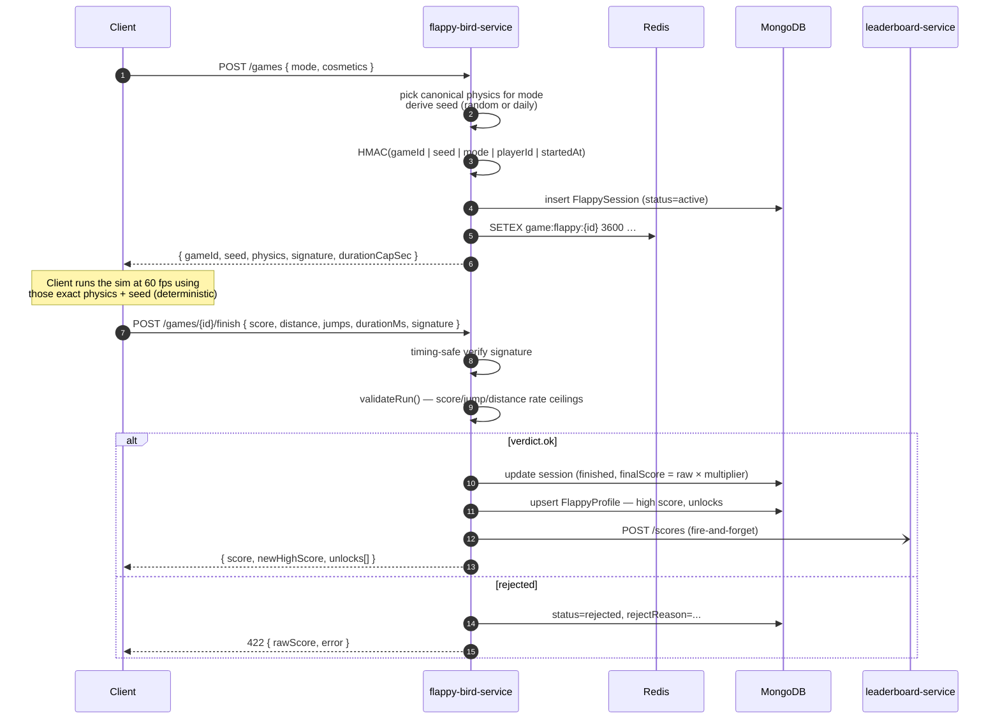

# 🎮 Games Platform — Microservices Architecture (v2)

## Overview

A production-grade microservices gaming platform where each game runs as an independent Docker container. A central platform layer provides shared authentication, leaderboard, and API gateway services...

## System Diagram



### Observability sidecar (additive, opt-in via second compose file)



## Services

| Service              | Port | Tech                     | Responsibility                         |
|----------------------|------|--------------------------|----------------------------------------|
| **gateway**          | 3000 | Nginx 1.25               | Reverse proxy, TLS termination, routing |
| **frontend**         | 80   | React 18 + Vite + Nginx  | SPA served as static files             |
| **auth-service**     | 3001 | Node/Express + Prisma    | Register, Login, JWT, Refresh tokens   |
| **leaderboard-service** | 3002 | Node/Express + Redis | Score submission, ranked leaderboards |
| **tic-tac-toe-service** | 3003 | Node/Express + Mongoose | Game logic, state via Redis+MongoDB |
| **guess-number-service** | 3004 | Node/Express + Mongoose | Guess game, scoring, state caching |
| **hangman-service**  | 3005 | Node/Express + Mongoose  | Hangman, difficulty tiers, masked-word view |
| **flappy-bird-service** | 3006 | Node/Express + Mongoose  | Six modes, cosmetic unlocks, HMAC-signed run validation |
| **postgres**         | 5432 | PostgreSQL 16            | Auth users, refresh tokens, scores     |
| **mongo**            | 27017 | MongoDB 7               | Game sessions, move history            |
| **redis**            | 6379 | Redis 7                  | Cache, sessions, leaderboard, pub/sub  |

## Data Flow

### Authentication



### Score submission (on game finish)



### Leaderboard read (Redis hot path)



### Game state (Redis cache-aside, MongoDB backing store)



### Flappy Bird run lifecycle (server-authoritative + HMAC-signed)



The client is trusted only for the **inputs** of a run; the server owns
the physics constants, the HMAC, and a per-mode score-rate ceiling
(`engine.maxScorePerSec * scoreSlack + 5`). Runs that exceed the ceiling
or whose distance is inconsistent with elapsed time × pipe speed are
recorded as `rejected` and never reach the leaderboard.

## Redis Key Convention

| Key Pattern                    | Type         | TTL  | Purpose                     |
|-------------------------------|--------------|------|-----------------------------|
| `refresh:{tokenHash}`         | String       | 7d   | Fast token lookup           |
| `leaderboard:{gameId}`        | Sorted Set   | —    | Per-game top scores         |
| `leaderboard:global`          | Sorted Set   | —    | All-games combined          |
| `game:ttt:{gameId}`           | JSON String  | 1h   | Tic-tac-toe state cache     |
| `game:guess:{gameId}`         | JSON String  | 1h   | Guess-number state cache    |
| `game:hangman:{gameId}`       | JSON String  | 1h   | Hangman state cache         |
| `game:flappy:{gameId}`        | JSON String  | 1h   | Flappy run state (mode, seed, signed) |
| `flappy:daily-seed:{YYYY-MM-DD}` | String    | 24h  | Shared seed for *Daily Seed* mode (same level for everyone that day) |

## Observability (MELT)

Every service is instrumented with OpenTelemetry via the shared
`@games-platform/observability` package, loaded zero-code via
`node --require @games-platform/observability/tracing` in each Dockerfile's
`CMD`. That gives you:

- **Traces** — auto-instrumented Express, HTTP, ioredis, mongoose, pg, axios
- **Metrics** — typed domain instruments in `gamesMetrics` (registrations,
  logins, games_started/finished/score/duration with a `mode` label for
  Flappy, hangman guess split, flappy jumps + pipes-passed counters,
  leaderboard submissions/lookups, active sessions gauge) plus auto HTTP
  metrics
- **Logs** — `createLogger(serviceName)` emits JSON with `trace_id` /
  `span_id` injected from the active span

The collector also runs the `docker_stats` receiver so per-container CPU /
memory / network arrive even on Docker Desktop where cAdvisor's filesystem
path is empty. Tempo's metrics-generator emits `traces_spanmetrics_*`
(RED) back to Prometheus via remote-write — the Overview dashboard's RED
panels read those.

Six dashboards are provisioned automatically: Overview, Auth, Games
(combined), Hangman, Guess Number, Tic-Tac-Toe — all cross-linked.

See **OBSERVABILITY.md** for: full custom-metric reference, dashboard
catalogue, how trace ↔ logs correlation is wired, troubleshooting, and
the production-hardening checklist.

## Adding a New Game

1. `cp -r services/tic-tac-toe-service services/my-game-service`
2. Implement game logic in `src/game/engine.ts` (pure functions)
3. Add `my-game-service` block in `docker-compose.yml` (copy 10 lines,
   keep `build.context: .` and `dockerfile: services/my-game-service/Dockerfile`)
4. Add Nginx `location /api/my-game/` block in `gateway/conf.d/routes.conf`
5. Add React page in `frontend/src/pages/` and route in `main.tsx`
6. Add game card to `GAMES` array in `frontend/src/pages/HomePage.tsx`
7. (Optional) Record domain metrics:

   ```ts
   import { gamesMetrics } from '@games-platform/observability';
   gamesMetrics.gameStartedTotal.add(1, { game: 'my-game' });
   gamesMetrics.gameFinishedTotal.add(1, { game: 'my-game', outcome: 'won' });
   ```

   The combined Games dashboard uses `sum by (game)`, so a new `game` label
   value appears as a new line — no dashboard change required.

**Zero changes** to auth-service, leaderboard-service, gateway logic, or
existing dashboards.

## Tech Stack

| Layer              | Technology                              |
|--------------------|-----------------------------------------|
| Frontend           | React 18, Vite 5, TypeScript, React Router |
| Gateway            | Nginx 1.25                             |
| Backend Services   | Node.js 20 LTS, Express 4, TypeScript  |
| Auth / ORM         | Prisma 5 + PostgreSQL 16               |
| Game Storage       | MongoDB 7 + Mongoose                   |
| Cache / Broker     | Redis 7 (ioredis)                      |
| Containerisation   | Docker + Docker Compose v2             |
| Shared Types       | `packages/shared-types/`               |
| Observability      | OpenTelemetry SDK + Collector contrib, Prometheus, Loki, Tempo, Grafana |
| Shared Telemetry   | `packages/observability/` — `gamesMetrics`, `createLogger`, OTel bootstrap |

## Running the Platform

```bash
# 1. Copy environment file
cp .env.example .env

# 2. Build and start the application stack
docker compose up --build

# 3. Open http://localhost:3000
```

First boot runs Prisma migrations automatically inside auth-service.

### With observability (optional)

```bash
docker compose \
  -f docker-compose.yml \
  -f docker-compose.observability.yml \
  up -d
```

Open Grafana at **http://localhost:3030** (admin / admin). Dashboards live in
the *Games Platform* folder.
