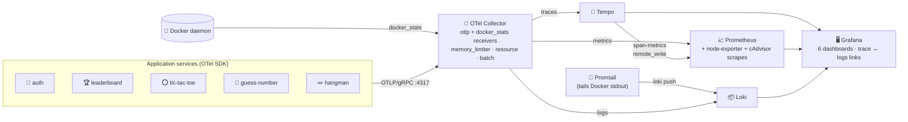

# Observability — Logs, Metrics, Traces

A lightweight, fully containerised **MELT** stack for the games platform,
layered on top of the application's Docker Compose setup as an additive
overlay. Every service is OpenTelemetry-instrumented and ships traces, logs,
and metrics through a single OpenTelemetry Collector.

## Contents

- [Stack at a glance](#stack-at-a-glance)
- [Quick start](#quick-start)
- [Access URLs & dashboards](#access-urls--dashboards)
- [How telemetry flows](#how-telemetry-flows)
- [Standardised logging](#standardised-logging)
- [Trace ↔ logs correlation](#trace--logs-correlation)
- [Custom metrics reference](#custom-metrics-reference)
- [Container metrics](#container-metrics)
- [Adding a new metric in 30 seconds](#adding-a-new-metric-in-30-seconds)
- [Configuration files](#configuration-files)
- [Environment variables](#environment-variables)
- [Troubleshooting](#troubleshooting)
- [Production hardening](#production-hardening)

## Stack at a glance

| Concern  | Component | Image |
| -------- | --------- | ----- |
| Ingest   | OpenTelemetry Collector (contrib)     | `otel/opentelemetry-collector-contrib:0.111.0` |
| Metrics  | Prometheus + node-exporter + cAdvisor | `prom/prometheus:v2.55.0`, `prom/node-exporter:v1.8.2`, `gcr.io/cadvisor/cadvisor:v0.49.1` |
| Logs     | Loki + Promtail                       | `grafana/loki:3.2.1`, `grafana/promtail:3.2.1` |
| Traces   | Tempo                                 | `grafana/tempo:2.6.0` |
| UI       | Grafana                               | `grafana/grafana:11.2.2` |



## Quick start

```bash
# Application stack + observability overlay together:
docker compose \
  -f docker-compose.yml \
  -f docker-compose.observability.yml \
  up -d --build
```

Generate some traffic:

```bash
curl -s -X POST http://localhost:3000/api/auth/register \
  -H 'content-type: application/json' \
  -d '{"username":"alice","email":"a@x.com","password":"secret123"}'

curl -s -X POST http://localhost:3000/api/hangman/games \
  -H 'content-type: application/json' \
  -d '{"difficulty":"medium"}'
```

## Access URLs & dashboards

| Service     | URL                       | Notes |
| ----------- | ------------------------- | ----- |
| Grafana     | http://localhost:3030     | login `admin` / `admin` (override with `GRAFANA_USER` / `GRAFANA_PASSWORD`) |
| Prometheus  | http://localhost:9090     | scrape targets at `Status → Targets` |
| Loki        | http://localhost:3100     | API only — query via Grafana → Explore |
| Tempo       | http://localhost:3200     | API only — query via Grafana → Explore |
| OTLP gRPC   | localhost:4317            | apps push here |
| OTLP HTTP   | localhost:4318            | apps push here |

Six dashboards are provisioned automatically (folder **Games Platform**):

| Dashboard | What it shows |
| --------- | ------------- |
| **Games Platform — Overview** | Per-service request rate, error rate, p50/p95/p99 latency, container CPU & memory (via `docker_stats`), top-of-page stat cards (active sessions, total req/s, error %), recent error+warn logs across the platform. |
| **Games Platform — Auth Service** | Active sessions gauge & timeseries, registrations & logins by `result`, login-failure rate, per-route request rate / p95 latency, auth warnings & errors. |
| **Games Platform — Games (combined)** | Started/finished by game, win-rate per game and per Hangman difficulty, score-distribution heatmap, hangman guess split, score submissions to leaderboard, leaderboard reads by scope, game-service warnings & errors. |
| **Games Platform — Hangman** | Per-game stats, outcomes by difficulty, guesses per second by kind/correctness, accuracy by difficulty, score & duration distributions, hangman-only logs. |
| **Games Platform — Guess Number** | Per-game stats, outcomes per second, score distribution heatmap, p50/p95 duration, guess-number logs. |
| **Games Platform — Tic-Tac-Toe** | Per-game stats including draw rate, outcomes per second, score & duration distributions, tic-tac-toe logs. |

All six dashboards cross-link via the page header.

## How telemetry flows

### Traces

`app SDK` → OTLP/gRPC :4317 → `otel-collector` → `tempo:4317` (OTLP)
→ Grafana **Explore → Tempo** (TraceQL or Search).

Tempo's **metrics generator** also emits `traces_spanmetrics_*` series
(request rate, error rate, latency histograms) and `traces_service_graph_*`
via remote-write to Prometheus, which power the RED panels in the Overview.

> Note: spanmetrics are labelled with `service` (Tempo's convention), while
> custom OTel metrics use `service_name` (resource attribute → label). The
> dashboards already account for both.

### Metrics

Three sources land in Prometheus:

1. **App OTLP metrics** (custom counters/histograms/gauges + auto HTTP) →
   collector → Prometheus exporter on `:8889/metrics` → Prometheus scrapes.
2. **`docker_stats` receiver** in the collector → per-container CPU /
   memory / network / blockio with `compose_service`, `container_name`,
   `container_image_name` labels. This is what populates the Overview's
   container panels on Docker Desktop where cAdvisor's filesystem path is
   empty.
3. **Infra exporters** — Prometheus also scrapes node-exporter (host CPU /
   memory / disk) and cAdvisor (cgroup metrics; primarily useful on Linux
   hosts).

### Logs

Two paths into Loki:

1. **App OTLP logs** (structured logs from the OTel SDK) → collector →
   Loki HTTP push API. Carry `trace_id` / `span_id` automatically.
2. **Container stdout/stderr** → **Promtail** (tails
   `/var/lib/docker/containers/*.log`) → Loki. Means every container's
   logs reach Loki even if it's not OTel-instrumented (e.g. postgres,
   mongo, redis, gateway).

Promtail parses JSON log lines and promotes `level`, `trace_id`, and
`span_id` so log → trace navigation works.

## Standardised logging

Every service uses the same logger, defined once in
`packages/observability/src/index.ts` and imported via a one-line wrapper:

```ts
// services/<svc>/src/utils/logger.ts
import { createLogger } from '@games-platform/observability';
export const logger = createLogger('hangman-service');
```

`createLogger(serviceName)` returns an object with `info`, `warn`, `error`,
`debug`. Each call emits a single JSON line on stdout/stderr, with the
service name baked in and `trace_id` / `span_id` injected when the call
happens inside an active span (Express, axios, mongoose, ioredis, pg, etc.
are all auto-instrumented):

```json
{
  "timestamp": "2026-05-10T13:07:11.421Z",
  "service":   "auth-service",
  "level":     "info",
  "message":   "User registered",
  "userId":    "9c7…",
  "username":  "alice",
  "trace_id":  "8b1c…",
  "span_id":   "f23a…"
}
```

In Grafana → Explore → Loki, click the `trace_id` field on a log line and
Grafana opens the matching trace in Tempo in a side panel.

## Trace ↔ logs correlation

Datasources are pre-wired:

- **Loki → Tempo**: any log line containing `"trace_id":"<hex>"` shows a
  *TraceID* link that opens the trace in Tempo (configured via
  `derivedFields` in
  `observability/grafana/provisioning/datasources/datasources.yaml`).
- **Tempo → Loki**: any span has a *Logs for this span* button that
  queries Loki for log lines tagged with the same `service.name` in a
  ±5 minute window.

The OTel SDK is loaded via `node --require @games-platform/observability/tracing`
in each Dockerfile's `CMD`, so apps don't need to import or call anything
to participate.

## Custom metrics reference

Defined once in `packages/observability/src/index.ts` (`gamesMetrics`),
recorded by individual services. After Prometheus name-mangling
(dots → underscores, type/unit suffixes appended), they appear as:

| Prometheus name | Type | Labels | Recorded by |
| --------------- | ---- | ------ | ----------- |
| `auth_registrations_total` | counter | `result` (`success` \| `conflict`) | auth-service |
| `auth_logins_total` | counter | `result` (`success` \| `invalid_credentials`) | auth-service |
| `auth_active_sessions` | observable gauge | – | auth-service (queries refresh-token table every 15 s) |
| `games_started_total` | counter | `game`, `difficulty` | hangman, guess-number, tic-tac-toe |
| `games_finished_total` | counter | `game`, `outcome` (`won` \| `lost` \| `draw`), `difficulty` | hangman, guess-number, tic-tac-toe |
| `games_score_{bucket,count,sum}` | histogram | `game`, `outcome`, `difficulty` | hangman, guess-number, tic-tac-toe |
| `games_duration_seconds_{bucket,count,sum}` | histogram (s) | `game`, `outcome` | hangman, guess-number, tic-tac-toe |
| `hangman_guesses_total` | counter | `kind` (`letter` \| `word`), `correct` (`true` \| `false`), `difficulty` | hangman |
| `leaderboard_score_submitted_total` | counter | `game` | leaderboard |
| `leaderboard_lookups_total` | counter | `scope` (`per_game` \| `global` \| `me`), `game` | leaderboard |

Histograms expose `_bucket`, `_count`, and `_sum` series and are queried
with `histogram_quantile()` (see the dashboards for examples).

Every metric also carries `service_name`, `service_version`, and
`deployment_environment` labels, plus auto-detected resource attributes
like `host_arch`, `process_runtime_version`, etc., because the collector's
`resource_to_telemetry_conversion: enabled` setting promotes resource
attributes to Prometheus labels.

> **Naming gotchas** (already handled in the dashboards, but useful to know
> when writing your own queries):
>
> - The OTel→Prometheus exporter appends `_total` to counters, `_bucket` /
>   `_count` / `_sum` to histograms, and the **unit** to histogram base
>   names (e.g. `games.duration` with `unit: 's'` becomes
>   `games_duration_seconds_*`).
> - Observable gauges declared with `unit: '1'` get a `_ratio` suffix
>   (`auth.active_sessions` would become `auth_active_sessions_ratio`). The
>   `auth.active_sessions` instrument is therefore declared **without** a
>   unit so it appears as plain `auth_active_sessions`.

## Container metrics

The collector's **`docker_stats` receiver** polls the Docker daemon's stats
API every 15 seconds and emits per-container metrics with rich labels:

| Prometheus name | Description |
| --------------- | ----------- |
| `container_cpu_utilization_ratio` | CPU usage as a fraction of one core |
| `container_memory_usage_total_bytes` | Resident memory |
| `container_memory_percent_ratio` | Memory as % of container limit |
| `container_network_io_usage_rx_bytes_total` | Cumulative bytes received |
| `container_network_io_usage_tx_bytes_total` | Cumulative bytes sent |
| `container_blockio_io_service_bytes_recursive_total` | Block I/O |

Useful labels: `compose_service`, `compose_project`, `container_name`,
`container_image_name`, `container_id`. The `compose_service` label is
mapped from the standard `com.docker.compose.service` Docker label and is
the most useful for grouping in dashboards.

> Why not just cAdvisor? On Docker Desktop (macOS / Windows), cAdvisor
> can't enrich containers because the host's `/var/lib/docker` is the VM
> image, not the daemon's data dir. cAdvisor only emits a single
> `id="/"` aggregate. The `docker_stats` receiver goes through the Docker
> API and therefore works on Docker Desktop. cAdvisor is kept around for
> Linux hosts where it adds value (cgroup-level detail).

## Adding a new metric in 30 seconds

1. Add it to the `build()` function in `packages/observability/src/index.ts`:

   ```ts
   myThingTotal: m.createCounter('my.thing', { description: '…' }),
   ```

2. Add the typed field to the `GamesMetrics` interface above it.
3. `cd packages/observability && npm run build`
4. Sync into each service's local mirror so the editor TS server can
   resolve the import:

   ```bash
   for s in services/*/; do
     cp -R packages/observability/dist        "$s/obs/dist"
     cp    packages/observability/package.json "$s/obs/package.json"
   done
   ```

5. Use it from any service:

   ```ts
   import { gamesMetrics } from '@games-platform/observability';
   gamesMetrics.myThingTotal.add(1, { reason: 'something' });
   ```

6. Rebuild that service image. The series appears in Prometheus within
   ~30 s (15 s SDK export + Prometheus scrape).

## Configuration files

| File | Purpose |
| ---- | ------- |
| `observability/otel-collector-config.yaml` | Collector pipelines (OTLP + docker_stats → Tempo / Prometheus / Loki) |
| `observability/prometheus.yml`              | Scrape config (collector, cAdvisor, node-exporter); remote-write receiver enabled |
| `observability/loki-config.yaml`            | Single-binary Loki, filesystem storage |
| `observability/promtail-config.yaml`        | Docker-SD log scraping + JSON parsing |
| `observability/tempo-config.yaml`           | OTLP receivers, span-metrics generator, service-graph generator |
| `observability/grafana/provisioning/`       | Datasources (Prometheus / Loki / Tempo with cross-links) + dashboard provider |
| `observability/grafana/dashboards/`         | Six provisioned dashboard JSONs |
| `packages/observability/`                   | Shared SDK package (`gamesMetrics`, `createLogger`, `withTrace`, OTel bootstrap) |

## Environment variables

Set in `.env` at the repo root (all are optional):

```bash
DEPLOY_ENV=development        # value of deployment.environment resource attribute
OTEL_LOG_LEVEL=warn           # collector + SDK log verbosity (`debug` for diagnosis)
GRAFANA_USER=admin
GRAFANA_PASSWORD=admin
```

App services receive these OTLP variables automatically from the overlay:

```
OTEL_EXPORTER_OTLP_ENDPOINT=http://otel-collector:4317
OTEL_EXPORTER_OTLP_PROTOCOL=grpc
OTEL_EXPORTER_OTLP_INSECURE=true
OTEL_LOGS_EXPORTER=otlp
OTEL_METRICS_EXPORTER=otlp
OTEL_TRACES_EXPORTER=otlp
OTEL_SERVICE_NAME=<service>
OTEL_RESOURCE_ATTRIBUTES=deployment.environment=${DEPLOY_ENV}
```

Services that don't load the OTel SDK simply ignore these variables.

## Troubleshooting

### No data in Grafana at all

```bash
docker logs otel-collector --tail=50
curl -fsS http://localhost:13133 || echo "collector unhealthy"
curl -fsS http://localhost:9090/api/v1/targets | jq '.data.activeTargets[] | {job:.labels.job, health}'
```

### Custom metrics missing for one service

The most common cause is that the service container was started **before**
its peers (or before the collector). Restart just that service:

```bash
docker compose -f docker-compose.yml -f docker-compose.observability.yml \
  up -d --force-recreate --no-deps <service>
docker restart games_sk-gateway-1   # so nginx re-resolves the new IP
```

Then drive a few requests against it and wait ~20 s for the next OTel
export window.

### "No data" on container CPU / memory panels

Confirm the `docker_stats` receiver is loaded on the collector:

```bash
docker logs otel-collector --tail=20 | grep -i docker_stats
curl -fsS http://localhost:8889/metrics | grep '^container_cpu_utilization_ratio' | head
```

If you see a `client version 1.25 is too old` error, bump
`api_version` in `observability/otel-collector-config.yaml` (current
default: `"1.43"`).

### No traces appearing in Tempo

- Check the collector pipeline: `docker logs otel-collector | grep -i tempo`.
- Confirm an app is actually pushing OTLP — set `OTEL_LOG_LEVEL=debug` on
  the app for one boot and look for `Exported N spans`.
- Tempo metrics-generator can take a couple of minutes to start producing
  `traces_spanmetrics_*` after a fresh boot.

### No container logs in Loki

- Promtail uses Docker SD; verify its targets:
  `docker logs promtail --tail=50` and look for "tail routine".
- LogQL test in Grafana Explore: `{project="games_sk"}` should return lines.

### `5xx` from a leaderboard GET / 404 from gateway

After `docker compose ... --force-recreate` on a service, nginx in the
gateway caches the old upstream IP. Run `docker restart games_sk-gateway-1`.

## Production hardening

| Area | Default | Production change |
| ---- | ------- | ----------------- |
| Storage | Loki / Tempo on local volumes | Object store (S3, GCS, Azure) for both |
| Retention | 7 d logs, 7 d traces, 15 d Prometheus | Tune per signal cost vs. value |
| Auth | Grafana basic auth | OAuth/OIDC via reverse proxy (oauth2-proxy etc.) |
| TLS | OTLP plaintext on `:4317` | mTLS at the collector edge; client certs in services |
| HA | Single-binary Loki / Tempo | Scalable mode (read/write split, ingester replicas) |
| Alerts | None pre-shipped | Alertmanager + Prometheus rules under `observability/prometheus/alerts/` |
| Backups | Volume snapshots | Object-store lifecycle + Grafana DB backup |
| Scrape interval | 15 s collector / 15 s Prometheus | Stay at 15 s; drop high-cardinality labels rather than slowing scrape |

## See also

- [`packages/observability/README.md`](packages/observability/README.md) — shared SDK helpers
- [OpenTelemetry Collector Contrib](https://github.com/open-telemetry/opentelemetry-collector-contrib)
- [Grafana Tempo docs](https://grafana.com/docs/tempo/latest/)
- [Grafana Loki docs](https://grafana.com/docs/loki/latest/)
- [OpenTelemetry semantic conventions](https://opentelemetry.io/docs/specs/semconv/)
