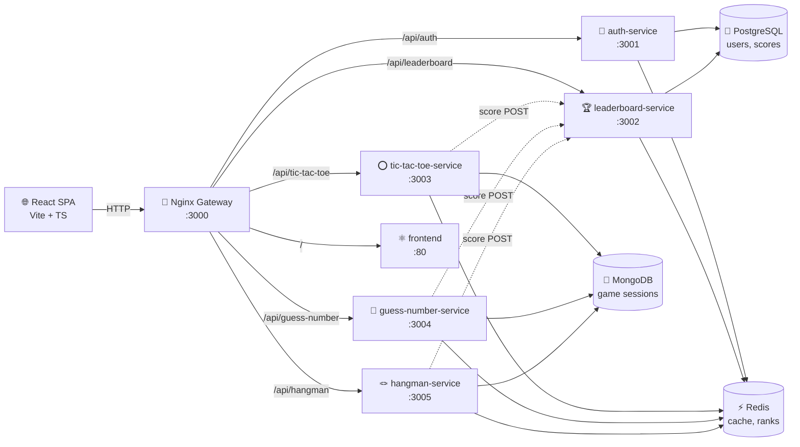
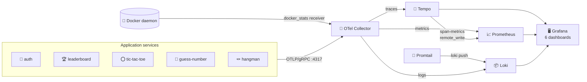

# 🎮 GameVault — Microservices Gaming Platform

A production-grade gaming platform built with a microservices architecture. Each
game runs as an independent Docker service. A central platform layer handles
authentication, leaderboards, API routing, and full **MELT** observability.

[](https://nodejs.org)
[](https://typescriptlang.org)
[](https://react.dev)
[](https://docs.docker.com/compose/)
[](https://postgresql.org)
[](https://mongodb.com)
[](https://redis.io)
[](https://opentelemetry.io)
[](https://grafana.com)

---

## Demo

<video src="https://raw.githubusercontent.com/SK-ILLish-GIT/games_sk/main/docs/gamevault-demo.mov" controls playsinline width="100%">
  Your browser does not support embedded video.
  <a href="https://drive.google.com/file/d/1EQIpRDiJsY3LrnXnq6uEkGnrXcjVPLee/preview">Watch on Google Drive</a>.
</video>

**[Open on Google Drive](https://drive.google.com/file/d/1EQIpRDiJsY3LrnXnq6uEkGnrXcjVPLee/preview)** (fallback if playback fails in your browser).

---

## ✨ Features

- 🔐 **JWT Authentication** — register, login, rotated refresh tokens, hashed at rest
- 🏆 **Live Leaderboards** — Redis Sorted Sets, atomically updated via Lua
- 🎲 **Tic-Tac-Toe** — pass-and-play, state in MongoDB + Redis
- 🔢 **Guess the Number** — classic 1–100 guess game with score & hints
- 🪢 **Hangman** — easy / medium / hard difficulty, masked-word view
- 🌐 **Nginx API Gateway** — single entry point, routes to all services
- ⚡ **Vite + React SPA** — fast dark-mode UI with animated pages
- 🔭 **Full Observability** — OpenTelemetry SDK in every service, Grafana
  dashboards for RED metrics, custom domain metrics, container CPU/memory,
  trace ↔ logs correlation

---

## 🏗️ Architecture



### Observability sidecar (opt-in overlay)



### Services

| Service | Port | Tech | Responsibility |
|---|---|---|---|
| **gateway** | 3000 | Nginx 1.25 | Reverse proxy & routing |
| **frontend** | 80 (internal) | React 18 + Vite + Nginx | SPA served as static files |
| **auth-service** | 3001 (internal) | Express + Prisma + PostgreSQL | Register, login, JWT, refresh tokens |
| **leaderboard-service** | 3002 (internal) | Express + Prisma + Redis | Score submission, ranked leaderboards |
| **tic-tac-toe-service** | 3003 (internal) | Express + Mongoose + Redis | Game logic, state persistence |
| **guess-number-service** | 3004 (internal) | Express + Mongoose + Redis | Guess game, scoring |
| **hangman-service** | 3005 (internal) | Express + Mongoose + Redis | Hangman with difficulty tiers |
| **postgres** | 5432 (internal) | PostgreSQL 16 | Auth users, refresh tokens, scores |
| **mongo** | 27017 (internal) | MongoDB 7 | Game sessions, move/guess history |
| **redis** | 6379 (internal) | Redis 7 | Cache, leaderboards, refresh-token lookup |

### Observability stack (overlay)

| Component | Image | What it does |
|---|---|---|
| **otel-collector** | `otel/opentelemetry-collector-contrib:0.111.0` | OTLP ingress; fans out to Tempo / Prometheus / Loki + `docker_stats` receiver |
| **prometheus** | `prom/prometheus:v2.55.0` | Scrapes collector + node-exporter; stores time series |
| **loki** | `grafana/loki:3.2.1` | Log storage; receives push from collector and Promtail |
| **promtail** | `grafana/promtail:3.2.1` | Tails every container's stdout into Loki |
| **tempo** | `grafana/tempo:2.6.0` | Distributed traces; emits span-metrics back to Prometheus |
| **grafana** | `grafana/grafana:11.2.2` | Dashboards (6 provisioned), Explore, alerts |
| **node-exporter** | `prom/node-exporter:v1.8.2` | Host CPU / memory / disk |
| **cadvisor** | `gcr.io/cadvisor/cadvisor:v0.49.1` | Cgroup metrics (Linux); on macOS the collector's `docker_stats` receiver fills the per-container gap |

---

## 🚀 Quick Start

### Prerequisites

- [Docker Desktop](https://docs.docker.com/desktop/) (with Docker Compose v2)
- Git

### 1. Clone the repo

```bash
git clone https://github.com/<your-username>/Games_sk.git
cd Games_sk
```

### 2. Configure environment

```bash
cp .env.example .env
# Edit .env to set a strong JWT_SECRET before deploying anywhere public
```

### 3. Build & launch

```bash
docker compose up --build
```

> First run takes ~2–3 minutes to build all images. Subsequent starts are fast.

### 4. Open the app

| URL | What |
|---|---|
| http://localhost:3000 | Full app (via gateway) |
| http://localhost:5173 | Vite dev server (frontend only, for dev) |

### 5. (Optional) Bring up the observability stack

A separate compose overlay adds OpenTelemetry Collector, Prometheus, Loki,
Tempo, and Grafana — and wires every service to push OTLP. Run alongside the
main stack:

```bash
docker compose \
  -f docker-compose.yml \
  -f docker-compose.observability.yml \
  up -d
```

| URL | What |
|---|---|
| http://localhost:3030 | Grafana (admin/admin) — six pre-provisioned dashboards |
| http://localhost:9090 | Prometheus — raw metric explorer |
| http://localhost:3100 | Loki API — logs (query in Grafana) |
| http://localhost:3200 | Tempo API — traces (query in Grafana) |

The provisioned dashboards (folder **Games Platform**):

- **Overview** — RED metrics by service, container CPU/memory, error log feed
- **Auth Service** — registrations, logins by result, active sessions, per-route p95
- **Games (combined)** — start/finish, win-rate, score-histo, leaderboard reads
- **Hangman** — letter-vs-word guess split, accuracy by difficulty, score histogram
- **Guess Number** — game outcomes, score & duration distribution
- **Tic-Tac-Toe** — outcomes (won / draw), score & duration distribution

See [OBSERVABILITY.md](OBSERVABILITY.md) for the full guide (how MELT
flows through the stack, custom-metric reference, trace ↔ logs correlation,
troubleshooting).

---

## 🛠️ Development

### Run the frontend in dev mode (hot-reload)

```bash
cd frontend
npm install
npm run dev          # starts at http://localhost:5173
```

> Vite proxies `/api` → `http://localhost:3000`, so keep Docker running for the backend.

### Run a single service locally

```bash
cd services/auth-service
npm install
# Set env vars (see .env.example)
npx prisma db push   # sync schema to local/docker postgres
npm run dev
```

### Re-rebuild only one container (e.g. after code change)

```bash
docker compose build auth-service
docker compose up -d auth-service
```

---

## 📁 Project Structure

```
Games_sk/
├── docker-compose.yml                  # Main stack (apps + databases + gateway)
├── docker-compose.observability.yml    # MELT overlay (OTel + Prom + Loki + Tempo + Grafana)
├── .env.example                        # Template — copy to .env
├── ARCHITECTURE.md                     # Deep-dive: data flow, Redis keys, observability
├── OBSERVABILITY.md                    # MELT guide: dashboards, custom metrics, troubleshooting
│
├── frontend/                           # React 18 + Vite SPA
│   ├── src/
│   │   ├── api/                        # Axios client + 401 silent-refresh
│   │   ├── components/                 # Navbar, animated UI primitives
│   │   ├── context/                    # AuthContext, ThemeContext
│   │   └── pages/                      # Home, Auth, TicTacToe, GuessNumber,
│   │                                   #   Hangman, Leaderboard, Architecture
│   └── Dockerfile
│
├── gateway/                            # Nginx reverse proxy
│   ├── conf.d/
│   │   ├── upstream.conf               # Upstream addresses (DNS via Compose)
│   │   └── routes.conf                 # /api/<svc>/ → service routing
│   └── Dockerfile
│
├── services/
│   ├── auth-service/                   # JWT auth + Prisma (PostgreSQL)
│   ├── leaderboard-service/            # Scores + Redis Sorted Sets
│   ├── tic-tac-toe-service/            # TTT engine + MongoDB + Redis
│   ├── guess-number-service/           # Guess engine + MongoDB + Redis
│   └── hangman-service/                # Hangman engine + MongoDB + Redis
│
├── packages/
│   ├── shared-types/                   # Shared TypeScript types between FE & BE
│   └── observability/                  # @games-platform/observability
│                                       #   ├── OTel SDK bootstrap (NodeSDK)
│                                       #   ├── createLogger(name) — JSON+trace_id
│                                       #   └── gamesMetrics — typed instruments
│
└── observability/                      # Stack configuration (collector, prom, loki,
                                        #   tempo, grafana provisioning + dashboards)
```

---

## 🔑 Environment Variables

Copy `.env.example` to `.env` and set these:

| Variable | Default | Description |
|---|---|---|
| `JWT_SECRET` | `change-me-in-production-min-32-chars` | **Change this!** Signs all JWTs |
| `JWT_EXPIRES_IN` | `15m` | Access token lifetime |
| `REFRESH_TOKEN_EXPIRES_IN` | `7d` | Refresh token lifetime |
| `POSTGRES_USER` | `gamesadmin` | PostgreSQL username |
| `POSTGRES_PASSWORD` | `gamespassword` | PostgreSQL password |
| `POSTGRES_DB` | `gamesplatform` | PostgreSQL database name |
| `MONGO_INITDB_ROOT_USERNAME` | `gamesadmin` | MongoDB root username |
| `MONGO_INITDB_ROOT_PASSWORD` | `gamespassword` | MongoDB root password |
| `GATEWAY_PORT` | `3000` | Host port for the gateway |
| `DEPLOY_ENV` | `development` | Tags every span/metric with `deployment.environment` |
| `OTEL_LOG_LEVEL` | `warn` | OTel SDK + collector log verbosity (`debug` for diagnosis) |
| `GRAFANA_USER` | `admin` | Grafana login (overlay only) |
| `GRAFANA_PASSWORD` | `admin` | Grafana login (overlay only) |

---

## 🧹 Code Style

Linting and formatting are managed at the **repo root** so each service /
package stays independent for builds. One config, one install, one place
to run it.

```bash
# one-time install
npm install

# common workflows
npm run lint          # ESLint on the entire repo (returns 0 = ok)
npm run lint:fix      # auto-fix what's auto-fixable (imports, sort, type-imports)
npm run format        # Prettier write all .{ts,tsx,md,yml,json,css}
npm run format:check  # Prettier dry-run (CI-friendly)
npm run check         # lint + format:check together
```

### Conventions

| Tool | What it enforces |
| ---- | ---------------- |
| **ESLint** | bug-finders (`no-debugger`, `no-throw-literal`, `prefer-const`), TypeScript rules (`@typescript-eslint`), React + hooks rules (`eslint-plugin-react`, `eslint-plugin-react-hooks`), unused-import removal (`eslint-plugin-unused-imports`) |
| **`simple-import-sort`** | Imports are grouped (built-ins → external → `@games-platform/*` → relatives → styles) and sorted within each group; consistent across all packages |
| **`consistent-type-imports`** | `import type { … }` for type-only references; auto-fix uses inline-type form |
| **Prettier** | 100-col width, single quotes, semis, trailing-comma `all`, LF line endings |
| **`.editorconfig`** | 2-space indent, UTF-8, LF endings — agreed on before Prettier even runs |

### Severity policy

- **`error`** — actual bugs / unsafe patterns (e.g. `no-debugger`)
- **`warn`** — style nits & cosmetic improvements (so existing code doesn't
  block CI)
- Most warnings are **auto-fixable** with `npm run lint:fix`

Configs live at the repo root: `eslint.config.mjs`, `.prettierrc.json`,
`.prettierignore`, `.editorconfig`. Per-package Docker / `tsc` builds are
unaffected — lint is a developer concern, not a runtime one.

---

## 🎮 Adding a New Game

The architecture is designed for easy game additions:

1. **Scaffold** a new service: `cp -r services/tic-tac-toe-service services/my-game-service`
2. **Implement** game logic in `src/game/engine.ts` (pure functions, no side effects)
3. **Register** in `docker-compose.yml` — copy the tic-tac-toe block, change port & name
4. **Route** in `gateway/conf.d/routes.conf` — add a `location /api/my-game/` block
5. **Build UI** — add a page in `frontend/src/pages/` and a card in `HomePage.tsx`
6. **Instrument** (auto): the new service inherits the `OTEL_*` env block from
   the observability overlay; just `import { gamesMetrics, logger } from
   '@games-platform/observability'` and call
   `gamesMetrics.gameStartedTotal.add(1, { game: 'my-game' })`. Series like
   `games_started_total{game="my-game"}` show up in Prometheus within ~30 s.

Zero changes to auth-service, leaderboard-service, gateway logic, or any
existing dashboard query needed.

---

## 🐛 Troubleshooting

**"Failed to load leaderboard"**  
→ The `scores` table may not exist. Run:
```bash
docker exec games_sk-leaderboard-service-1 npx prisma db push --accept-data-loss
```

**"Registration failed" / "Failed to create game"**  
→ Backend services may not be healthy yet. Check:
```bash
docker compose ps        # all should be "healthy"
docker compose logs -f   # watch for errors
```

**Port 3000 already in use**  
→ Set `GATEWAY_PORT=3001` in `.env` and restart.

**Grafana is empty / "no data" on every panel**  
→ See the troubleshooting section in [OBSERVABILITY.md](OBSERVABILITY.md#troubleshooting).
The two most common causes are: (1) services were started **before** the
observability overlay so they couldn't reach `otel-collector:4317`, or (2)
the gateway's nginx cached old upstream IPs after `--force-recreate`.
A quick `docker compose ... up -d` followed by `docker restart games_sk-gateway-1`
usually fixes both.

---

## 📄 License

MIT — see [LICENSE](./LICENSE) for details.
